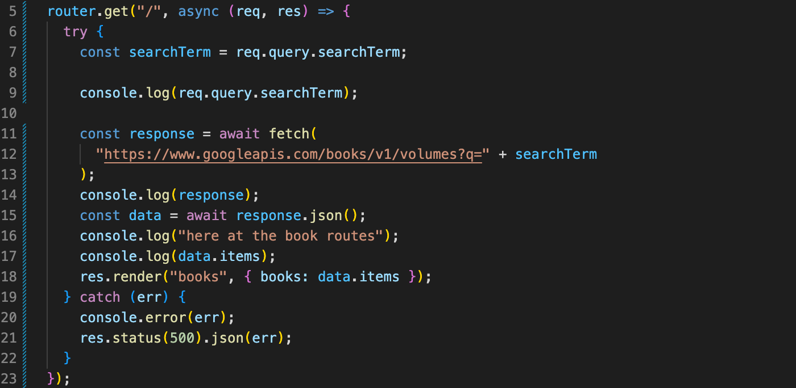
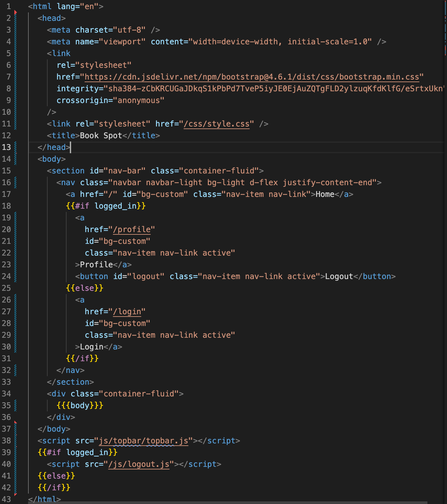
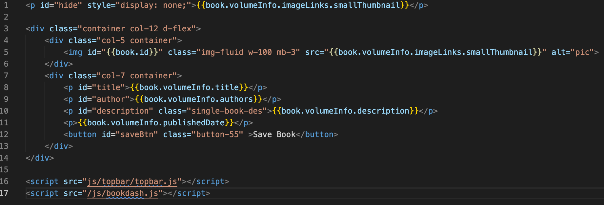
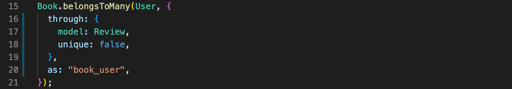
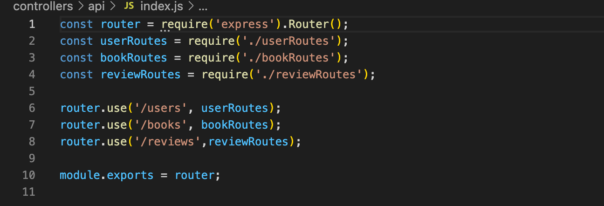

# Book Spot
[](https://opensource.org/licenses/MIT)

## Description
This application allows user to search books by author, genre and more. Each book will be accompanied by author, description and published date. User can favorite books they like and the book data will be saved and display under their profile page. Application is deployed through Heroku.

Deployed link:
https://aqueous-plateau-74718.herokuapp.com/

## Table of Contents
* [Installation](#installation)
* [Usage](#usage)
* [Gif Demo](#gif-demo)
* [Code Snippets](#code-snippets)
* [Credits](#credits)
* [Contributors](#contributors)
* [License](#license)

## Installation
The following will be a guide about installing the application and getting it to run once completed
- Start by forking the repository 
- Next perform a npm install
```bash
npm install 
```
- Then, create a dotenv file input the DB_NAME=book_db, DB_USER="your_user", DB_PASSWORD="your_password" 
- Now desired changes can be made if desired
- Then, seed the database
```bash
npm run seed
```
- Once that is all completed, in the terminal start the server
```bash
node server.js 
```
## Usage

The following application allows the user to:
- Search for books by volume, genre, author
- See details about the book such as author, title, description
- Save the book to their own personal list
- Upvote and downvote the book
- Add reviews for the book
- Delete books from personal profile
- Create personal account with name, email, and password

## Gif Demo


## Code Snippets


Example of fetching from Google Book API



Application uses Handlebars as the templating language



Example of how Handlebars was used to render results



Associations for the model



Separating routes for cleaner code




## Credits

| Technologies used|Front-end|Back-end|
| -|-:| -:|
||Handlebars||
||||
||||
||Fetch||
||||
|||Session|
|||Cookie|
|||Handlebars|
|||Node fetch|--


| API used| 
| ------------- |
| [Google Book API](https://developers.google.com/books)|

| Third Party Libraries|
| ------------- |
| [Boostrap](https://getbootstrap.com/) | 
| [Topbar](https://buunguyen.github.io/topbar/)


## Contributors
* Mateo Navarro [LinkedIn](https://www.linkedin.com/in/mateonav/) | [GitHub](https://github.com/mateonav98)
* Kristy Guo [LinkedIn](www.linkedin.com/in/kristixxg) | [GitHub](https://github.com/kristixxg)
* Richard Ferry [LinkedIn](https://www.linkedin.com/in/richard-ferry-83120514b/) | [GitHub](https://github.com/rich-f-p)

## License
[](https://opensource.org/licenses/MIT)

Copyright (c) 2022 Mateo Navarro, Kristy Guo & Richard Ferry

Permission is hereby granted, free of charge, to any person obtaining a copy
of this software and associated documentation files (the "Software"), to deal
in the Software without restriction, including without limitation the rights
to use, copy, modify, merge, publish, distribute, sublicense, and/or sell
copies of the Software, and to permit persons to whom the Software is
furnished to do so, subject to the following conditions:

The above copyright notice and this permission notice shall be included in all
copies or substantial portions of the Software.

THE SOFTWARE IS PROVIDED "AS IS", WITHOUT WARRANTY OF ANY KIND, EXPRESS OR
IMPLIED, INCLUDING BUT NOT LIMITED TO THE WARRANTIES OF MERCHANTABILITY,
FITNESS FOR A PARTICULAR PURPOSE AND NONINFRINGEMENT. IN NO EVENT SHALL THE
AUTHORS OR COPYRIGHT HOLDERS BE LIABLE FOR ANY CLAIM, DAMAGES OR OTHER
LIABILITY, WHETHER IN AN ACTION OF CONTRACT, TORT OR OTHERWISE, ARISING FROM,
OUT OF OR IN CONNECTION WITH THE SOFTWARE OR THE USE OR OTHER DEALINGS IN THE
SOFTWARE.

